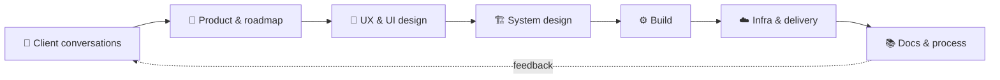

  

  

  
  <!--  -->

> I came to software from **computational ecology**, modeling how plant–pollinator networks hold together and how they break under perturbation.
> I still read systems the same way: follow the information, find where it fractures, redesign the flow before the friction becomes normal.

---

## ⚡ In numbers

<table>
  <tr>
    <td align="center" width="33%"><h2>30s → 3s</h2>dashboard load times after I rebuilt the analytics engine to run in the browser</td>
    <td align="center" width="33%"><h2>1.5 days</h2>to ship a multi-provider auth migration, schema refactor included, ahead of a client demo</td>
    <td align="center" width="33%"><h2>400+</h2>commits across 12 repos in the last quarter</td>
  </tr>
  <tr>
    <td align="center"><h2>6 → 1</h2>products running on one shared platform I design end to end</td>
    <td align="center"><h2>1 week</h2>to build, publish and roll a shared UI library out across 3 products</td>
    <td align="center"><h2>1.5%</h2>silent data loss I caught in a financial pipeline, spanning two fiscal years</td>
  </tr>
</table>

---

## 🧭 What I actually do

The whole loop, at a small B2B SaaS company:

- 🏗️ **Lead engineer.** System design across the product suite, engineering standards, and guiding the rest of the team.
- 🧭 **Associate PM.** Run client demos, shape features and the roadmap, and own the design language and UI.
- ☁️ **AWS, end to end.** Org and identity, networking, compute, storage, CI/CD.
- 🔄 **Data engineering.** Client data integrations, layered pipelines, and the analytics engines on top.
- 📚 **Docs, process & consulting.** ADRs, design docs, process definition, and business consulting.

---

## 🔒 Built under NDA (described loosely)

<b>Expand</b>

 

- **In-browser analytics engine.** DuckDB-WASM in Web Workers with a two-tier memory + OPFS cache, hierarchy filtering with predicate pushdown. This is where the 30s → 3s comes from.
- **Pipeline DSL.** Declarative specs compiled to SQL and run locally via sqlglot, SQLMesh and DuckDB.
- **Versioned data workflows.** Imports with tree diffs and preview/confirm, draft → publish layers, optimistic concurrency, append-only changelogs, live presence over SSE.
- **LLM agent features.** Provider-agnostic agent loop, tool registry, model gateway with a usage ledger, and a fixture-based eval harness.
- **Multi-product platform.** gRPC service contracts, multi-provider auth, regional deployment topology, tenant isolation at the infrastructure level.
- **Enterprise data integration.** Tolerant parsers for messy source systems, bronze → silver → gold pipelines, run-level observability, desktop agents.
- **Production hardening.** Job reconciliation without an outbox, circuit breakers, thundering-herd and N+1 fixes, metrics.

---

## 🌱 In the open

<table>
  <tr>
    <td>
      <b><a href="https://github.com/Shreyas-Agarwal/transit-intelligence">🚇 transit-intelligence</a></b> 
      Real-time public transit observability on GTFS / GTFS-RT.  
      📡 Realtime feed ingestion → Redpanda 
      🔁 Crash-recoverable downloader with bounded queues and OpenTelemetry benchmarks 
      🥉→🥈 Parquet medallion pipeline, Python + SQLMesh analytics 
      🛡️ Full governance stack: Conventional Commits + DCO, gitleaks, Vale, Renovate
    </td>
  </tr>
</table>

🧪 **Labs:** [go-event-lab](https://github.com/Shreyas-Agarwal/go-event-lab) (concurrency & event-processing benchmarks) · [lakehouse-engineering-lab](https://github.com/Shreyas-Agarwal/lakehouse-engineering-lab) (one system, Pandas → Spark)

---

## 🛠️ Stack

  

  
  
  
  
  
  

---

## 💬 Things I say too often

<table>
  <tr>
    <td align="center" width="50%">
       🧩  
      <b><i>"Most scaling problems are coordination problems in disguise."</i></b>
        
    </td>
    <td align="center" width="50%">
       🩹  
      <b><i>"Temporary workarounds are architecture nobody reviewed."</i></b>
        
    </td>
  </tr>
  <tr>
    <td align="center">
       📝  
      <b><i>"Write the ADR before you write the code."</i></b>
        
    </td>
    <td align="center">
       🌋  
      <b><i>"Systems fracture long before infrastructure breaks."</i></b>
        
    </td>
  </tr>
</table>

  ────────── ✦ ──────────

<h3 align="center"><i>"Good systems reduce cognitive load. Great systems disappear into the workflow."</i></h3>

---

## 📈 The receipts

  

  

  

  
  

  

